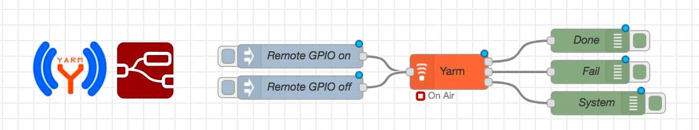

# node-red-contrib-yarm

<abstract>
Node-RED nodes to talk via USB port with a YarmDev board 
and then to a remote Yarm node via ISM 868MHz
</abstract>

### Main scope

The main scope of this project is to provide an easy way to use 
the Yarm modules as remote controlled nodes using a ISM 868MHz 
crypted link.

@wip

### Sources

* [package.json](./package.json)
* [yarm.html](./yarm.html)
* [yarm.js](./yarm.js)

### Node installing

In your home directory type these commands:

	mkdir node-red-contrib-yarm
	wget https://www.tanzolab.it/www/package.json
	wget https://www.tanzolab.it/www/yarm.html
	wget https://www.tanzolab.it/www/yarm.js
	cd ~/.node-red
	npm install ../node-red-contrib-yarm

then restart Node-RED:

	sudo systemctl restart node-red

### Links

* [Creating your first node](https://nodered.org/docs/creating-nodes/first-node#lower-casehtml)
* node-red-node-serialport
	* [Web page](https://flows.nodered.org/node/node-red-node-serialport)
	* [Github repository ](https://github.com/node-red/node-red-nodes)
* My development Node-RED environment: <http://www.tanzolab.it:1880/>
* [Yarm Radio module](https://www.acmesystems.it/yarm)
* [Elenco icone](https://nodered.org/docs/creating-nodes/appearance#icon)

@include='bio_sergio_tanzilli' 
